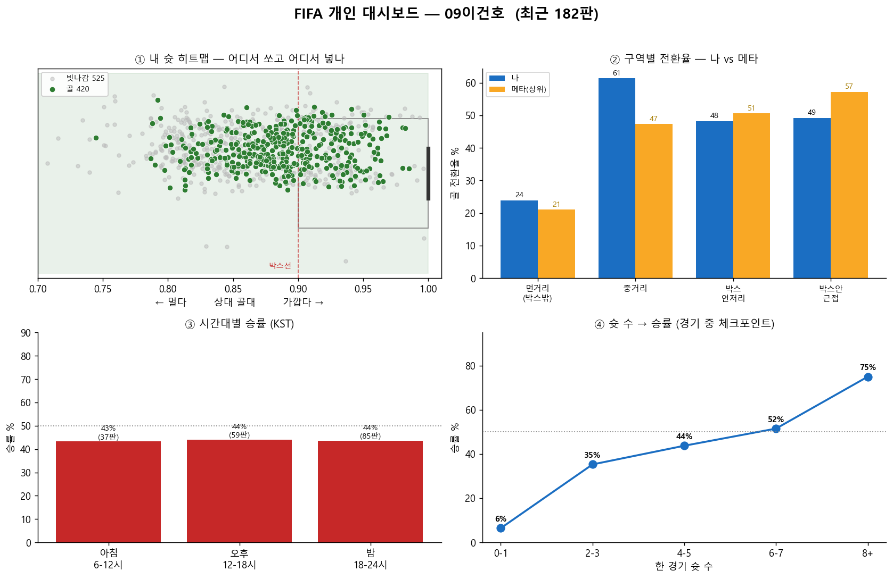
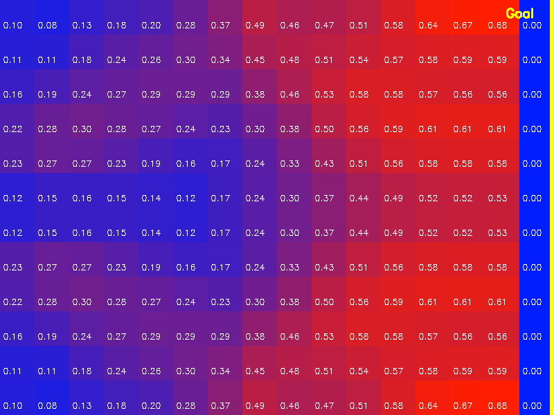
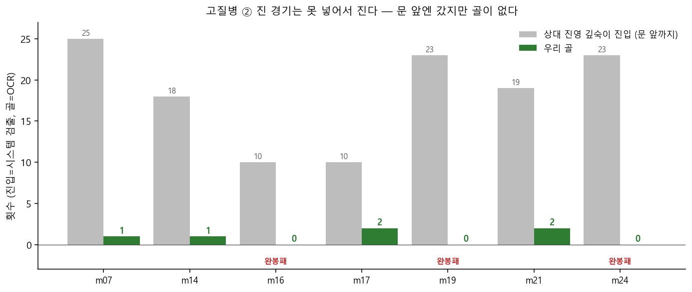

# FIFA Coach — FC 온라인 데이터 분석 코칭 시스템

> FC 온라인(EA SPORTS FC ONLINE) 경기를 **컴퓨터 비전 + 넥슨 공식 API** 로 분석해, 데이터 기반 개인화 코칭 피드백을 생성하는 시스템.

경기 영상에서 게임 상태를 추출하고, xT(expected threat) 가치 평가와 통계 분석을 결합해 *"이 행동이 좋았나, 어디를 고쳐야 하나"* 를 정량적으로 답한다.

---

## 주요 화면

**개인 대시보드** — 슛 히트맵, 구역별 골 전환율(vs 상위 등급), 시간대·슛 수별 승률을 한 장에.



**xT(expected threat) 가치맵** — 미니맵을 16×12 격자로 나눠 각 위치의 득점 기대값을 계산 (오른쪽 골대에 가까울수록 高).



**데이터 분석 예시** — 0골로 진 경기들의 "상대 진영 진입 vs 실제 골" 비교. 진입은 많은데 골이 안 나는 패턴을 정량화.



---

## 핵심 엔지니어링 판단 — 문제 → 판단 → 해결

### 1. 전체화면 3D 인식 대신 미니맵 2D 분석 아키텍처
- **문제** — 중계 화면에서 선수·공·골대를 직접 인식하려면 대규모 라벨링과 3D tactical 모델이 필요해 개인 프로젝트로는 비현실적.
- **판단** — FC 온라인 미니맵에는 22명의 위치와 공이 **2D로 추상화**되어 있다. 그걸 직접 읽으면 된다.
- **해결** — 미니맵만 분석하는 파이프라인으로 설계. 영상 1개로도 작동하는 구조 완성.

### 2. HSV 컬러 마스킹 + 컨투어 검출로 오브젝트 위치 인식
- 미니맵의 팀별 dot을 **HSV 색공간 임계값**으로 분리하고 **컨투어 검출**로 공·조작 선수·양팀 위치를 프레임 단위로 추출.
- 빨강 유니폼(우리 팀 색이 반전되는 케이스)을 **dot 검출률로 자동 감지**해 분기 처리하는 로직 구현.

### 3. xT(expected threat) 가치 모델로 행동 정량화
- 미니맵을 **16×12 격자**로 나누고 공격 방향을 정규화한 뒤, 각 행동의 위치 가치 변화를 xT로 계산 → "이 패스가 득점 기대값을 얼마나 올렸나"를 수치로 평가.

### 4. CV의 정확도 한계를 넘어 넥슨 공식 API로 데이터 소스 고도화
- **문제** — 스코어보드 OCR·이벤트 검출에서 오독(골 자릿수 오독 등)이 발생, 집계 지표 신뢰도에 한계.
- **판단** — 넥슨 Open API가 **골 시각·슛 좌표(x/y)·선수별 스탯**을 정확히 제공함을 확인.
- **해결** — API를 주 데이터 소스로 채택하고 **218경기 수집·캐싱 파이프라인** 구축. 정확도를 확보하고, 영상 없이 **닉네임만으로 분석**할 수 있게 확장.

### 5. 소표본 통계 착시를 막는 검증 프레임워크 설계
- **문제** — 적은 표본에서 "패턴처럼 보이는" 통계적 착시 위험.
- **판단** — 사건 클러스터를 주장하기 전 **베이스라인·노출 시간 보정**이 필수.
- **해결** — 노출 보정 **hazard(위험률) 분석**, **상대 등급 통제 비교**, 슛 위치 히트맵 등 검증 도구를 구현해 **데이터 기반 의사결정**으로 결론을 검증.

---

## 주요 기능

- **개인 대시보드** — 슛 히트맵, 구역별 골 전환율(vs 상위 등급), 시간대·슛 수별 승률
- **메타 갭 분석** — 대상 유저의 플레이 지표를 상위 등급 기준선과 비교
- **포메이션·선수 배치 A/B 분석** — 슛 좌표·선수별 스탯 기반으로 최적 배치 도출
- **경기별 패인 진단** — 실점 경위·슛 위치로 "이 판에서 왜 졌나" 분석

---

## 기술 스택

| 영역 | 사용 기술 |
|---|---|
| 컴퓨터 비전 | OpenCV (HSV 컬러 마스킹, 컨투어 검출), YOLOv8, EasyOCR |
| 가치 모델 | xT(expected threat) 격자 모델 |
| 데이터 분석 | Python, NumPy, Pandas, Matplotlib — hazard 분석, 등급 통제 비교, 히트맵 |
| 데이터 소스 | 넥슨 Open API (매치 상세·선수 스탯·슛 좌표) |

---

## 저장소 구조

```
src/
  extract_game_state.py   # 미니맵 → 게임상태 CSV (dot 검출)
  detect_teams.py         # HSV 마스킹 기반 팀/공/선수 dot 분리
  detect_events.py        # 이벤트(패스·슛·골) 분류
  detect_goals_ocr.py     # 스코어보드 OCR 골 검출
  grid.py / xt_model.py   # 16×12 격자 + xT 가치맵
  coaching_report.py      # 코칭 리포트 생성
  fetch_api.py            # 넥슨 API 매치 수집·캐싱
  prescription.py         # 프로 경기 대비 처방 분석
  detect_yolo.py          # YOLOv8 미니맵 객체 검출
dashboard.py              # 개인 대시보드(슛 히트맵·전환율·승률)
meta_gap.py / lowtier_gap.py     # 메타 갭 분석
pull_striker_test.py / check_formation.py   # 포메·배치 A/B
ranked_vs_friendly.py / why_lost.py         # 경기별 진단
train_yolo.py             # YOLOv8 학습
```

---

## 실행

```bash
pip install -r requirements.txt
```

넥슨 API 스크립트는 [넥슨 Open API](https://openapi.nexon.com) 키가 필요하다.
키는 코드에 넣지 말고 저장소 루트에 `.nexon_key`(한 줄)로 두면 자동으로 읽는다 (`.gitignore` 처리됨).

```bash
python dashboard.py               # 개인 대시보드 생성
python why_lost.py <상대닉네임>     # 특정 경기 패인 분석
```

---

## 제외 항목

용량·보안상 다음은 저장소에서 제외했다(`.gitignore`): 게임 영상, API 응답 캐시, 학습 모델 가중치, API 키.
